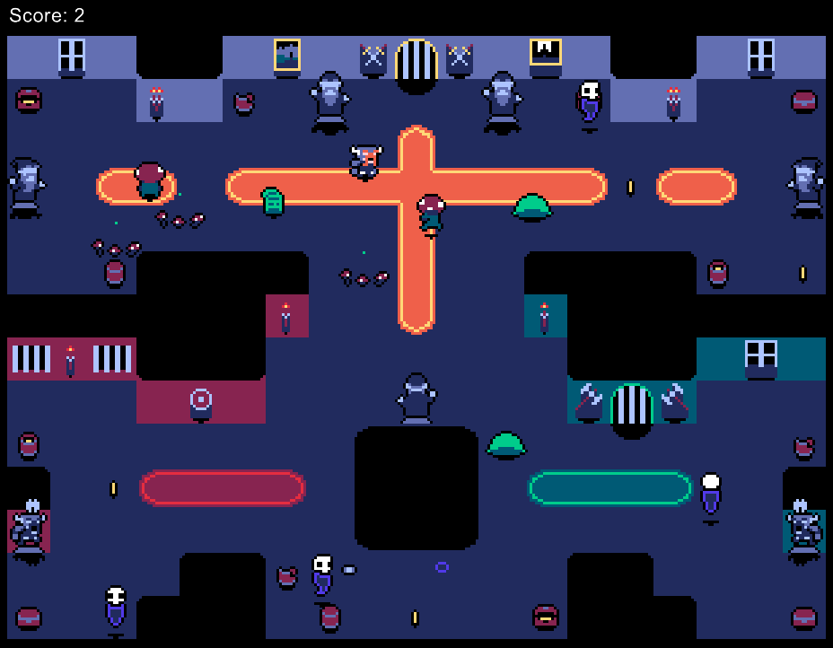

# Pixel Dungeon

A 2D tile-based adventure game framework built in Ruby using the [Gosu](https://www.libgosu.org/) library. This project serves as a foundational structure for developing sprite-based games, featuring basic character animations, enemy behaviors, and map interactions.

<p align="center">
  
</p>

## 🎮 Features

- **Tile-Based Rendering**: Utilizes Gosu for efficient 2D graphics rendering.
- **Character Animations**: Basic animation system for player and enemy sprites.
- **Enemy AI**: Simple behaviors for enemies like slimes, shrooms, and ghasts.
- **Map System**: Basic map loading and tile management.
- **Audio Support**: Background music playback.

## 🧱 Built to Expand

Pixel Dungeon runs on a tile-based system, meaning the world is made up of small, modular pieces. This keeps things flexible and makes it easy to:
- Design new levels or generate them procedurally
- Add custom tile types (e.g. traps, doors, hazards)
- Build features like fog of war or destructible environments
- Keep movement, collision, and pathfinding simple and consistent

This architecture is perfect for layering on new ideas (or even simply building new maps!)

### 🤝 Contributing

Whether it’s a new enemy, tile type, or a bug fix — all contributions are welcome. Please do fork the repo and submit a pull request.

## 🗂️ Project Structure

```
Pixel-Dungeon/
├── animation.rb # Handles sprite animations
├── character.rb # Base class for all characters
├── ghast.rb # Ghast enemy behavior
├── main.rb # Entry point of the game
├── map1.rb # Map layout and logic
├── music.wav # Background music file
├── player.rb # Player character logic
├── shroom.rb # Shroom enemy behavior
├── slime.rb # Slime enemy behavior
├── tiles.rb # Tile definitions and rendering
├── sprites/ # Directory containing sprite images
└── .gitignore # Git ignore file
```

## 🛠️ Getting Started

### Prerequisites

- [Ruby](https://www.ruby-lang.org/en/downloads/) (version 2.5 or higher recommended)
- [Gosu](https://www.libgosu.org/) gem

### Installation

**1. Clone the repository**:

```bash
git clone https://github.com/adrianmuzzi/Pixel-Dungeon.git
cd Pixel-Dungeon
```

**2. Install Dependencies**
You'll need the Gosu library:
```
gem install gosu
```

**3. Run!**
From the root directory:
```
ruby main.rb
```


### 📄 License
This project is open-source and available under the MIT License.
